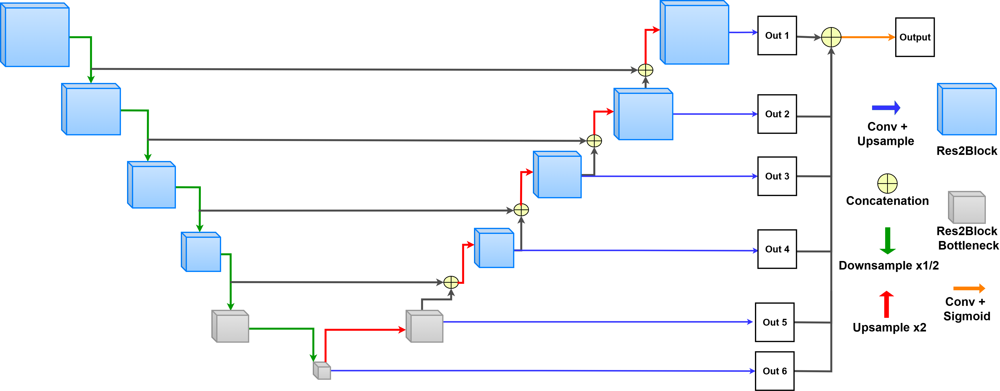
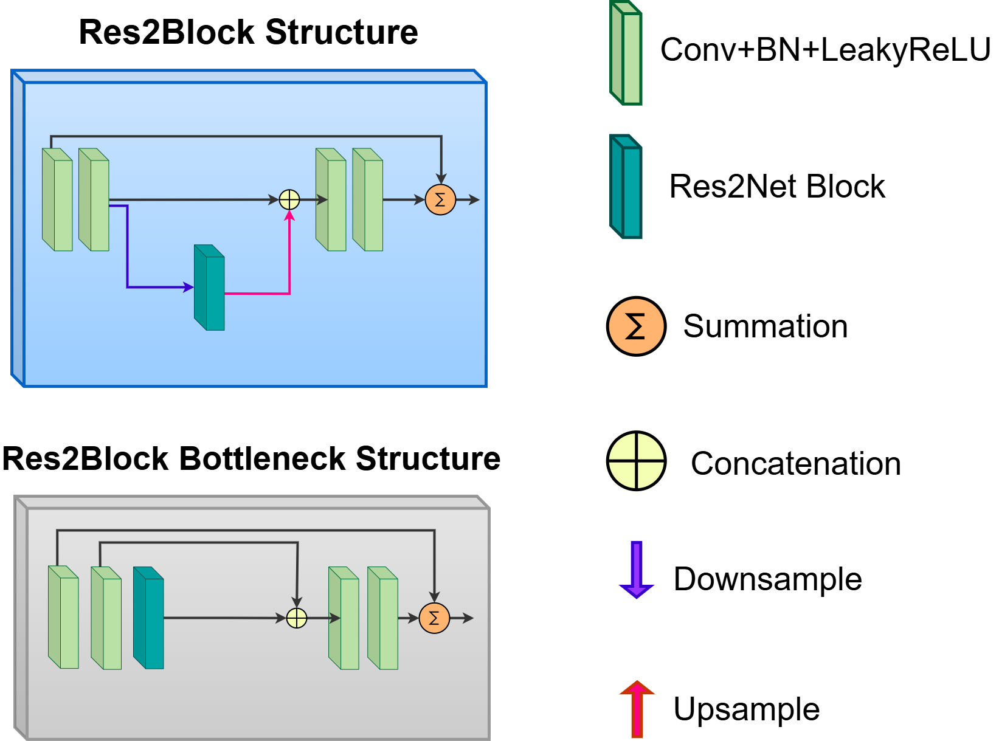
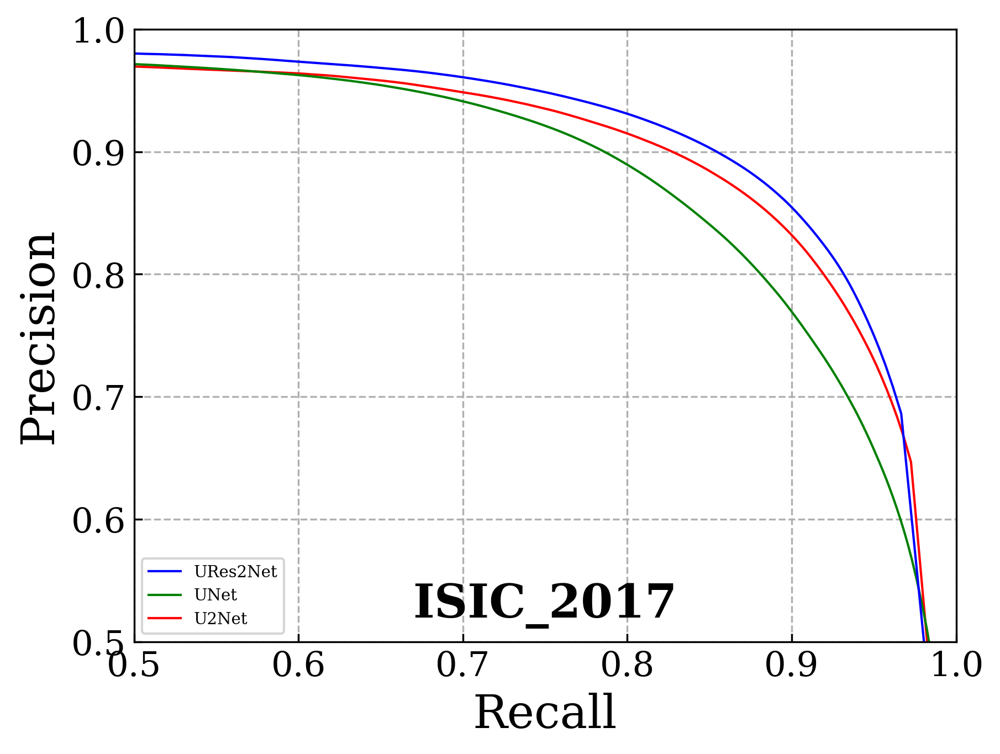
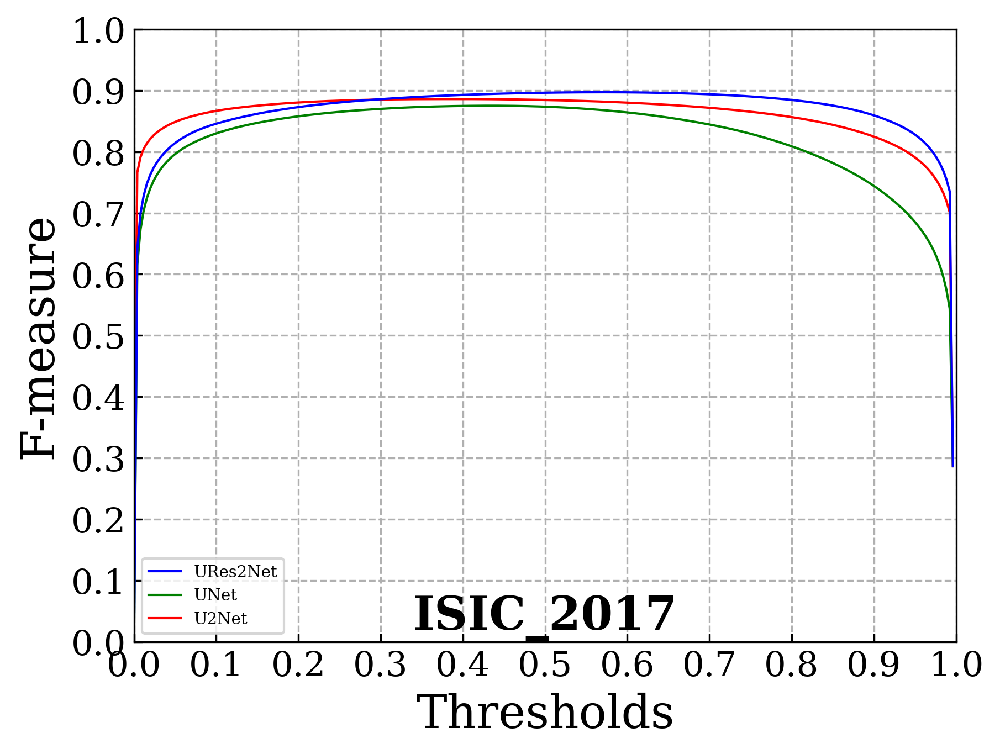

# URes2Net
Implementation of URes2Net for biomedical semantic segmentation.
The model is evaluated on skin lesion dataset. (ISIC-2017)

## 🧠 URes2Net Architecture
URes2Net biomedical semantic segmentation architecture is as follows.
<p align="center">
  
</p>
Residual blocks used in the URes2Net architecture are as follows.
<p align="center">
  
</p>

## 📈 Precision–Recall Curve
The Precision–Recall curve below shows the performance of the segmentation model on the ISIC-2017 skin lesion segmentation dataset.  

<p align="center">
  
</p>

## 🎢 F-measure Curve
<p align="center">
  
</p>

## ⚙️ URes2Net Model Weights
Download the trained model from [Google Drive](https://drive.google.com/file/d/18LT4r3_5nH18q1vjqukkbh-HzOslKnZx/view?usp=sharing).
## 📁 File Structure

```training and testing
project_root/
├── ISIC_2017/                 
│   ├── Train/
│      ├── ISIC-2017_Training_Data/     
│      ├── ISIC-2017_Training_Part1_GroundTruth/   
│   └── Test/
│      ├── ISIC-2017_Test_v2_Data/     
│      ├── ISIC-2017_Test_v2_Part1_GroundTruth/             
│
├── my_model_weights/
│   ├── ures2net_ISIC2017_epoch_100_train_0.371395_tar_0.050255.pth
│
├── model.py        
├── dataloader.py        
├── train.py               
└── test.py
              
```


## 📚 Citation
```
If you use this work or model in your research, please cite the paper:
@misc{seyma2025,
title={URes2Net: U-Net Architecture with Res2Net for Skin Lesion Segmentation},
author={Karagozoglu, Seyma and Hardalac, Fırat},
year={2025},
}
```
